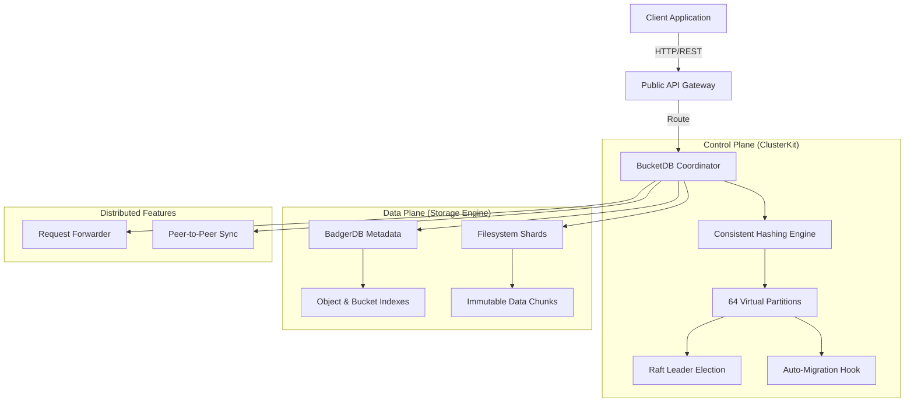

# BucketDB

**Distributed Object Storage Engine.** High-performance, self-hosted, S3-like scalability.

---

## 🏗️ Architecture

Masterless, Raft-based coordination.



## ✨ Features

- **Distributed**: Consistent hashing, request forwarding, zero-downtime rebalancing.
- **Resilient**: Configurable replication (RF=3) and fault tolerance.
- **Fast**: Metadata offloading to BadgerDB, parallel chunking.
- **Safe**: End-to-end SHA256 integrity checks.
- **S3 Compatible**: Basic S3 Gateway for standard clients (e.g., `aws s3`, `boto3`).
- **Developer Ready**: Universal REST API, Web Dashboard, Range Requests.

---

---

## � Quick Start

### 🐳 Docker (Recommended)

**Cluster (3 nodes):**
```bash
docker compose up -d
```
Access: `http://localhost:9080`, `http://localhost:9081`, `http://localhost:9082`

**Single Node:**
```bash
docker run -d -p 9080:9080 -p 8080:8080 skshohagmiah/bucketdb -bootstrap=true
```

### Local Dev
```bash
go get github.com/skshohagmiah/bucketdb
./run_cluster.sh
```

### 🖥️ Dashboard
Visit `http://localhost:9080` to:
- Monitor cluster status
- Upload/Download files
- Browse objects

---

---

---

## 💻 Client Examples

### Go
```go
// Upload
http.Post("http://localhost:9080/objects/bucket/file", "text/plain", reader)
// Download
http.Get("http://localhost:9080/objects/bucket/file")
```

### Node.js
```js
const axios = require('axios');
const api = axios.create({ baseURL: 'http://localhost:9080' });
// Upload
await api.post('/objects/bucket/file', fs.readFileSync('file.jpg'));
// Download
await api.get('/objects/bucket/file', { responseType: 'arraybuffer' });
```

### Python
```python
import requests
# Upload
requests.post("http://localhost:9080/objects/bucket/file", data=open("f.pdf", "rb"))
# Download
requests.get("http://localhost:9080/objects/bucket/file")
```

---

## 📡 API Reference

| Method | Endpoint | Description |
|---|---|---|
| `POST` | `/objects/:bucket/:key` | Upload object |
| `GET` | `/objects/:bucket/:key` | Download object |
| `DELETE` | `/objects/:bucket/:key` | Delete object |
| `GET` | `/buckets` | List buckets |
| `POST` | `/buckets` | Create bucket |
| `GET` | `/cluster` | Cluster status |

---

## 🧩 Embedded (Go)

```go
config := bucketdb.DefaultConfig()
db, _ := bucketdb.NewBucketDB(config)
defer db.Close()

db.CreateBucket("assets", "admin")
db.PutObject("assets", "video.mp4", data, opts)
db.GetObject("assets", "video.mp4", nil)
```

---


## ⚙️ Config

```go
type Config struct {
    ChunkSize       int64  // 4MB
    StoragePath     string // ./chunks
    MetadataPath    string // ./metadata
    MaxObjectSize   int64  // 5GB
    CompressionType string // "snappy"
    Cluster         clusterkit.Options
}
```

---

## 📈 Benchmarks

| Operation | Latency (p99) | Throughput |
|---|---|---|
| Meta Read | 0.8ms | 15k req/s |
| Chunk Read | 12ms | 540 MB/s |

---

## � License

MIT. See [LICENSE](LICENSE).

---
*Built with ❤️ by the BucketDB Team.*
